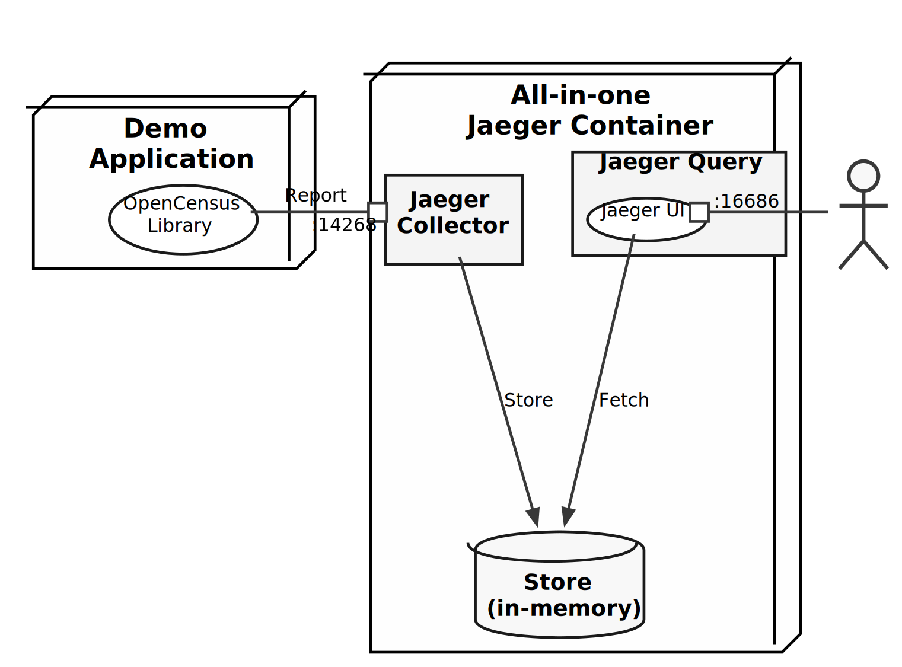

# opencensus-and-jaeger-Sample

The sample application to integrate with tracing and logging.



## Getting Started

The simplest way to run a Jaeger is use the all-in-one image.  This
image also contains an agent but this demo does not used it. 

```bash
$ docker run -d --name jaeger \
    -p 16686:16686 \
    -p 14268:14268 \
    jaegertracing/all-in-one:1.8
```

`main.go` is a simple HTTP server program and each process is traced
by the OpenCensus client library.

```bash
$ go run main.go
```

Let's feed carrot and fish to the Gopher.

```bash
$ curl http://localhost:8080/carrot
Finished eating

$ curl http://localhost:8080/fish
Finished eating
```

Jaeger UI shows tracing results.  Which request is the longest? To
click the Span shows the detail.

```bash
$ open http://localhost:16686/search
```

> Gopher hates fish so it is slow to eat.
